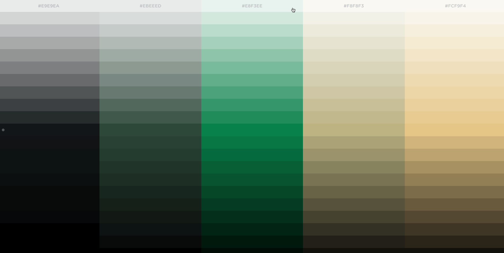
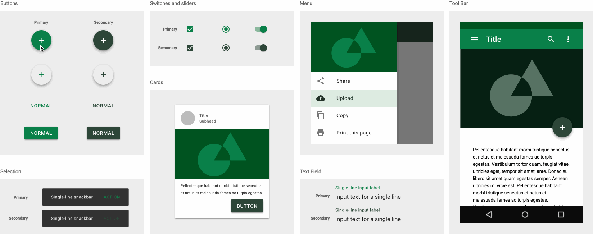

<h1 align="center">
  trifold
</h1>
<h4 align="center">
  A Pokémon-inspired protein folding game.
</h4>

  
  

## A Detour For Design
### Color Palette

### Color Palette Example with Material Design

## Running Instructions
(coming soon!)